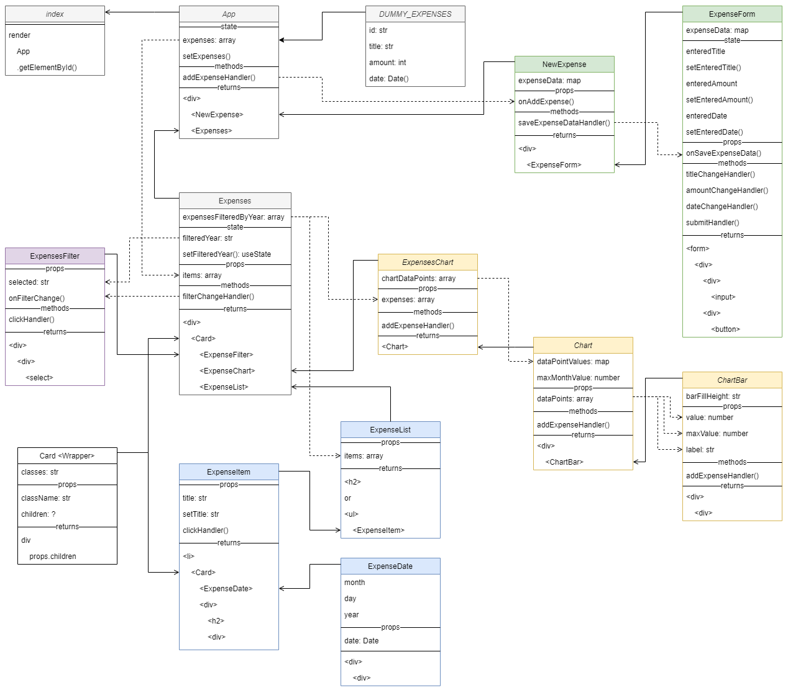

# Expenses In React

## Overview

Displays monthly expenses and chart. Allows to add a new expense.

Expenses app build using React by following steps from 
[React - The Complete Guide](https://www.udemy.com/course/react-the-complete-guide-incl-redux/) course
(sections 3-5).

Theory introduction presentation:
* section 3: [basics working with components](https://github.com/academind/react-complete-guide-code/blob/03-react-basics-working-with-components/slides/slides.pdf)
* section 4: [state events](https://github.com/academind/react-complete-guide-code/blob/04-react-state-events/slides/slides.pdf)

## Structure

Tree:

```
App
  ├─ NewExpense
  │  └─ ExpenseForm
  └─ Expenses (Card)
     ├─ ExpensesFilter
     ├─ ExpensesChart
     │  └─ Chart
     │     └─ ChartBar
     └─ ExpensesList
        └─ ExpenseItem (Card)
           └─ ExpenseDate
```

----

Diagram:



----

Animation:

